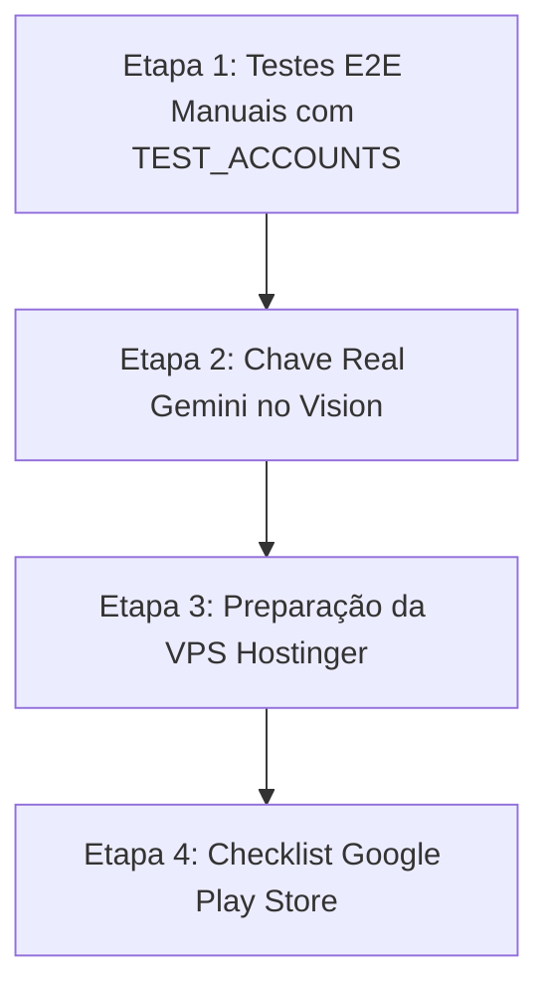

# PataNet — Walkthrough Consolidado e Roadmap de Evolução

> **Documento Vivo de Engenharia de Software:**  
> Este documento registra o histórico completo da modernização do ecossistema PataNet (PetEasy) executada nas 5 Waves estruturadas, o estado atual de cada repositório e o roteiro detalhado das próximas fases de homologação, publicação na Google Play Store e deploy em produção na Hostinger.

---

## 1. Histórico Completo de Passos Realizados (Waves 1 a 5)

### Wave 1: Banco de Dados, Docker & Prisma ORM (`commit 5c07425`)
- **Problema Inicial:** Backend acoplado ao MySQL 8.4 com 28 migrações manuais do TypeORM e falhas de concorrência por simulação de UUID como `VARCHAR(36)`.
- **Ação Executada:**
  - Migração para **PostgreSQL 16 com Prisma ORM**.
  - Criação de dois containers isolados no Docker Desktop: `api-postgres-1` (porta 5434 para dev) e `api-postgres-test-1` (porta 5433 para testes E2E).
  - Modelagem do `prisma/schema.prisma` com 22 entidades declarativas, incluindo suporte nativo a UUID de 16 bytes e extensão `pgvector`.
  - Adaptação estrita de todos os repositórios na camada `infrastructure/persistence/prisma/` preservando 100% dos contratos das entidades de domínio e use cases da Clean Architecture / DDD Hexagonal.
  - Desinstalação total do TypeORM, `mysql2` e remoção da pasta `migrations/`.

### Wave 2: Swagger OpenAPI & Estabilização da Suíte E2E (`commit 384d2fe`)
- **Problema Inicial:** Falta de documentação viva de contratos para o frontend e 16 testes E2E falhando por race conditions no Jest.
- **Ação Executada:**
  - Implantação do Swagger OpenAPI no NestJS sob a rota `/api/docs` com Bearer Auth (`JWT`).
  - Ativação do Swagger CLI Plugin no `nest-cli.json` para inferência de tipos em DTOs.
  - Criação do script `pnpm run docs:export` que gera o contrato estático `docs/swagger.json` (60 rotas).
  - Estabilização da suíte E2E com `--runInBand`, isolamento no banco de testes (porta 5433) e dinamização de fixtures com `uniqueSuffix()`.
  - Resultado: **108 de 108 testes E2E aprovados (100% verde)**.

### Wave 3: Módulos de Negócio, CRMV, Petshops PJ, Adoção & Play Store (`commit ac85715`)
- **Ação Executada:**
  - **Módulo Veterinário (`/vet`):** Role especial `VETERINARIAN`, concessão exclusiva pelo Admin após validação de CRMV/UF, autorização prévia pelo tutor (`VeterinarianAuthorization`) e prontuário médico imutável (`MedicalRecord`) com vacinas oficiais com fé pública.
  - **Módulo Petshop PJ & Adoção Responsável (`/petshops`):** Conta institucional PJ com validação de CNPJ/alvará pelo Admin. Proibição estrutural de venda de animais e transação atômica em 3 tabelas (`TransferPetCustodyUseCase`) para transferência de titularidade da PJ para o tutor adotante com Termo Digital de Adoção.
  - **Presença em Eventos:** Controle atômico via transação Prisma com lock `SELECT ... FOR UPDATE`, fila de espera (`WAITLIST`) e promoção automática de inscritos.
  - **Conformidade Google Play Store & LGPD:**
    - `TermsAcceptedGuard` global exigindo termos vigentes.
    - Exclusão de conta in-app (`DELETE /users/me`) e via link público desautenticado (`POST /delete-account`) com transferência de posts/comentários públicos para usuário sentinela (`deleted-user@patanet.internal`) e expurgo irreversível de dados pessoais.
    - Filtro de bloqueios mútuos no feed com cláusula `NOT IN`.
    - Despacho de denúncias preparado para webhooks de entidades públicas de proteção animal (`PUBLIC_AUTHORITY_REPORT_WEBHOOK`).
  - Resultado: **278/278 testes unitários aprovados** e **108/108 testes E2E aprovados**.

### Wave 4: PataNet Vision — IA Biométrica & Laudo Forense VLM (`commit e8531f5`)
- **Ação Executada:**
  - Scaffold limpo em FastAPI com Pydantic v2 em `c:\WillenWorks\PataNet\vision`.
  - Pipeline de biometria animal: extração dos top-5 frames por variância Laplaciana em vídeos de até 15s, recorte YOLOv8n-seg, embeddings estruturais (CLIP ViT-B/32) e filtragem cromática HSV de lama e sangue.
  - `AbuseDetector`: Triagem automatizada de ferimentos graves, desnutrição extrema (BCS) e coleiras incrustadas para alertas de emergência.
  - `VlmReportService`: Laudo forense explicativo e empático ao tutor via Gemini 2.0 Flash VLM.
  - Relato público sem login "Avistei um Pet" em menos de 10 segundos via `POST /internal/sightings/analyze`.
  - 18 testes unitários passando e Dockerfile CPU-only leve.

### Wave 5: Frontend Mobile & Monorepo DevOps (`commits a28ee9e` e `ed86750`)
- **Ação Executada:**
  - Implementação das telas no React 19 / Capacitor 7:
    - Modal bloqueante de Termos LGPD (`TermsGateModal.jsx`).
    - Botão dinâmico de presença em eventos com badge da `WAITLIST` (`EventDetail.jsx`).
    - Vitrine de Adoção Responsável com assinatura do Termo Digital (`PetsAdoptable.jsx`).
    - Carteira de vacinação com selo "Validado por Médico Veterinário" com CRMV/UF e lote (`PetDetail.jsx`).
    - Página pública "Avistei um Pet" com gravação de vídeo até 15s e captura de GPS (`SightingReport.jsx`).
    - Exclusão de conta Google Play Store com confirmação em duas etapas (`AccountDeletion.jsx`).
  - Suíte de testes com Vitest integrada ao app (**10/10 testes passando**).
  - Build do React e sincronização Capacitor Android (`pnpm cap sync android`) 100% aprovados.
  - Unificação do monorepo na raiz (`c:\WillenWorks\PataNet`) com `docker-compose.yml` e pipeline CI/CD no `.github/workflows/ci.yml`.

---

## 2. Política de Branching: Isolamento Dev vs Produção (Main)

> **Regra do Projeto:**  
> Os arquivos da pasta `dev-docs/`, scripts de seed de desenvolvimento e arquivos de teste pertencem **exclusivamente à branch `dev`**.  
> Em produção (`main`), a aplicação roda apenas com os fontes limpos e compilados.

### Como o isolamento é garantido tecnicamente:
1. **No Docker de Produção (`api/.dockerignore`):** A diretiva `dev-docs` e `*.md` impede que documentações e fixtures sejam copiadas para a imagem de produção da VPS.
2. **No Git (`.gitattributes`):** A diretiva `export-ignore` configurada para `dev-docs/**` assegura que ferramentas de release e empacotamento (`git archive`) ignorem esses arquivos.
3. **No Deploy na Hostinger:** A VPS faz pull exclusivo da branch `main`, na qual as migrações são aplicadas via `prisma migrate deploy` sem rodar o seed de desenvolvimento.

---

## 3. Próximas Etapas e Roadmap de Homologação



### Etapa 1: Homologação Local de Ponta a Ponta (E2E Manual)
- Iniciar os serviços conforme o [ENVIRONMENT_SETUP_GUIDE.md](file:///c:/WillenWorks/patanet/api/dev-docs/ENVIRONMENT_SETUP_GUIDE.md).
- Utilizar as contas pré-configuradas em [TEST_ACCOUNTS.md](file:///c:/WillenWorks/patanet/api/dev-docs/TEST_ACCOUNTS.md) para validar cada jornada:
  - **Jornada Tutor & LGPD:** Logar com `usuario.sem.termos@patanet.app.br`, verificar o bloqueio pelo modal e a liberação após o clique em "Aceitar".
  - **Jornada Veterinário & CRMV:** Logar com `vet.aprovado@patanet.app.br`, acessar o pet **Rex**, registrar vacina oficial e prontuário médico.
  - **Jornada Petshop & Adoção Responsável:** Logar com `adotante@patanet.app.br`, acessar a vitrine de pets da petshop, candidatar-se para adotar o **Thor** e assinar o Termo Digital.
  - **Jornada No-Login na Rua:** Acessar `/avistei-um-pet` deslogado, gravar vídeo de 5 segundos e submeter o avistamento.
  - **Jornada Exclusão de Conta:** Testar a exclusão com a conta `adotante@patanet.app.br` e verificar a realocação para o usuário sentinela no Prisma Studio.

### Etapa 2: Ativação da IA Real no PataNet Vision
- Obter uma chave de API do Google AI Studio (`https://aistudio.google.com/`).
- Inserir a chave no `c:\WillenWorks\PataNet\vision\.env`:
  ```ini
  GEMINI_API_KEY=AIzaSy...
  ```
- Testar o envio de duas fotos reais de cães para validar o laudo forense gerado pelo Gemini 2.0 Flash VLM.

### Etapa 3: Preparação e Deploy na VPS Hostinger (`72.60.245.7`)
- Como o snapshot no hPanel e os backups de produção (`.env.production.backup` e dump do MySQL) já estão salvos e seguros:
  1. Instalar Docker e Docker Compose na VPS Hostinger se ainda não estiverem presentes.
  2. Subir o container PostgreSQL 16 de produção na VPS.
  3. Configurar as variáveis no `.env` da VPS apontando para o PostgreSQL e AWS S3.
  4. Executar `npx prisma migrate deploy` no servidor.
  5. Configurar o proxy reverso do Nginx para apontar o tráfego de `api.patanet.app.br` para o container do NestJS.

### Etapa 4: Submissão para a Google Play Store
- Gerar o bundle assinado do app Android via Capacitor (`pnpm cap open android` no Android Studio).
- Verificar o cumprimento das diretrizes de publicação:
  - Link público de exclusão de conta acessível (`https://patanet.app.br/delete-account`).
  - Política de privacidade atualizada em link acessível.
  - Formulário de declaração de segurança de dados no Google Play Console (mencionando que dados pessoais são expurgados a pedido e fotos de pets são usadas exclusivamente para identificação e resgate).
