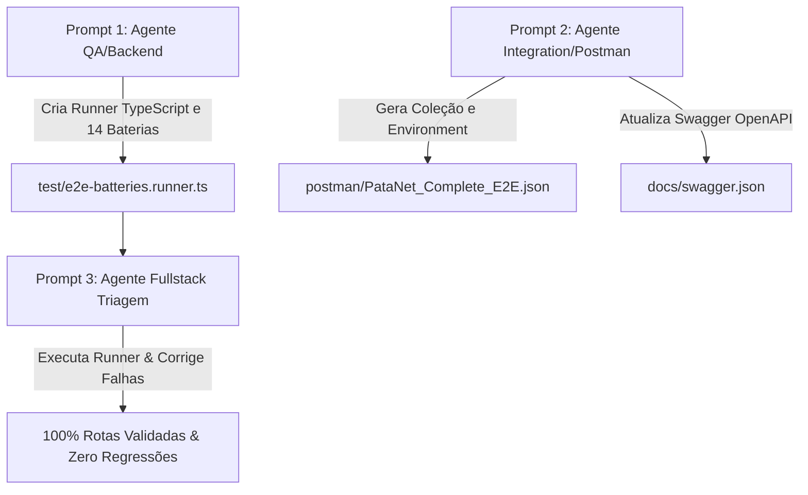

# Prompts de Engenharia e QA para Execução das Baterias de Testes do PataNet

> **Instrução de Governança para o Desenvolvedor / Arquiteto:**  
> Este documento contém os prompts diretivos e estruturados para que agentes autônomos seniores (ex: Claude Code, Antigravity, agentes CLI) executem a demanda completa do plano de implementação de testes de todas as rotas do PataNet.
> Os prompts são divididos em 3 etapas sequenciais e auto-suficientes.

---

## 📋 Visão Geral das Tarefas por Agente



---

## 🚀 PROMPT 1: Criação do Test Runner Automatizado de Baterias E2E

Copie e forneça o bloco abaixo para o agente dev senior responsável pelo backend/automação:

```markdown
Você é um Engenheiro de Software Sênior especializado em Arquitetura de Testes e QA para APIs NestJS e Clean Architecture.

### CONTEXTO E OBJETIVO:
No ecossistema PataNet, temos uma API NestJS rodando em http://localhost:3001 (dev) com banco PostgreSQL 16 local (porta 5434). A matriz de contas de teste com papéis (Admin, Veterinário, Petshop PJ, Tutor, Co-Tutor, Adotante, Bloqueador, etc.) está definida em `api/dev-docs/TEST_ACCOUNTS.md`, todas com a senha padrão `Patanet@Dev2026!`.

Sua missão é implementar um runner automatizado de testes de ponta a ponta (E2E) em TypeScript que percorra as 14 baterias funcionais do sistema, validando status codes HTTP e payloads para mais de 85 rotas da API.

### ARQUIVOS DE REFERÊNCIA:
1. `api/dev-docs/TEST_ACCOUNTS.md` — Matriz de contas e credenciais.
2. `api/docs/swagger.json` — Contrato OpenAPI oficial.
3. `api/src/modules/*/presentation/controllers/*.ts` — Controllers da API.
4. `app/src/api/*.js` — Clientes HTTP consumidos pelo frontend.

### REQUISITOS TÉCNICOS DO RUNNER:
1. Crie o arquivo `api/test/e2e-batteries.runner.ts`.
2. O script deve:
   - Ler a URL base de `process.env.API_URL || 'http://localhost:3001'`.
   - Conter uma camada de autenticação que realiza login dinâmico em `POST /auth/session` (com `{ username, password }`) e armazena os tokens JWT em cache por usuário (`mariana.santos`, `dev.patanet`, `carlos.vet`, `petshop.parceira`, `lucas.cotutor`, `adotante`, `bloqueador`, etc.).
   - Executar sequencialmente as 14 BATERIAS FUNCIONAIS:
     - Bateria 1: Auth & Sessão (`POST /auth/session`, `POST /auth/refresh`, validação de 401).
     - Bateria 2: Usuários & Termos (`GET /users/me`, `GET /users/:id`, `PATCH /users`, `GET /users/me/terms`, `POST /users/me/terms/accept`, teste de 403 do `TermsAcceptedGuard`).
     - Bateria 3: Catálogo Oficial (`GET /animals/species`, `GET /animals/breeds`, `GET /animals/breeds?specieId=...`).
     - Bateria 4: Pets & Mídias (`POST /animals`, `GET /animals/:id`, `PATCH /animals/:id`, `POST /animals/:id/hide`, `POST /animals/:id/unhide`, `POST/GET/DELETE /animals/medias/:animalId`).
     - Bateria 5: Tutoria & Compartilhamento (`GET /animals/owners/:userId`, `POST/PATCH/DELETE /animals/:animalId/owners/:ownerId`).
     - Bateria 6: Prontuário de Saúde (`POST/GET/PATCH/DELETE` para vaccines, dewormings e medications).
     - Bateria 7: Rede Social & Feed (`POST /posts`, `GET /posts/feed`, `GET /posts/me`, `POST/DELETE /posts/like/:id`, `POST/DELETE /posts/comment/:id`, `DELETE /posts/:id`).
     - Bateria 8: Conexões Sociais (`POST /connections/:id`, `GET /connections/summary/:id`, `GET /connections/followers/:id`, `GET /connections/followeds/:id`, `DELETE /connections/:id`).
     - Bateria 9: Moderação & Bloqueios (`POST /blocks/:id`, `GET /blocks`, `DELETE /blocks/:id`, `POST /reports`, `GET /reports/mine`, `PATCH /reports/:id/status`).
     - Bateria 10: Eventos Pet (`POST /events`, `GET /events`, `GET /events/:id`, `POST/DELETE /events/:id/attend`, `GET /events/:id/attendees`).
     - Bateria 11: Adoção Responsável (`GET /animals/adoptable`, `POST /animals/:id/adopt`, `GET /adoption-requests`).
     - Bateria 12: Módulo Clínico Veterinário (`POST /vet/register`, `PATCH /admin/vet/:id/status`, `POST /animals/:id/medical-records`).
     - Bateria 13: Petshops PJ (`GET /petshops`, `GET /petshops/:id`, `PATCH /admin/petshops/:id/status`).
     - Bateria 14: Central de Ajuda & Exclusão (`POST /support`, `GET /support/mine`, `POST /support/:id/messages`, `GET /support/all`, `PATCH /support/:id/status`).
   - Formatar o output no console com cores e símbolos (`✔ PASS`, `✖ FAIL`), tempo de resposta de cada requisição e resumo final (Total executado, Passou, Falhou).
   - Exportar o relatório da execução em arquivo JSON estruturado: `api/test/e2e-batteries-report.json`.
3. Adicione o script `"test:batteries": "ts-node -r tsconfig-paths/register test/e2e-batteries.runner.ts"` no `api/package.json`.
4. Valide a execução rodando `pnpm run test:batteries` no diretório `api/`.
```

---

## 📦 PROMPT 2: Geração da Coleção Postman v2.1 e Sincronização Swagger

Copie e forneça o bloco abaixo para o agente dev sênior responsável pela integração e documentação OpenAPI:

```markdown
Você é um Especialista em Integração de APIs, Swagger OpenAPI e Postman Collections.

### CONTEXTO E OBJETIVO:
Precisamos disponibilizar para a equipe de QA e desenvolvedores uma coleção Postman v2.1 completa e atualizada, cobrindo todas as rotas e fluxos da API PataNet, além de re-exportar a documentação Swagger OpenAPI para garantir paridade absoluta de contratos com as alterações recentes (módulos de connections, users/terms, breeds/species e adoptions).

### ARQUIVOS DE REFERÊNCIA:
1. `api/docs/swagger.json` — Documento base OpenAPI da aplicação.
2. `api/src/swagger/export.ts` e `api/src/swagger/swagger.config.ts`.
3. `api/postman/` — Diretório de destino da coleção.

### ETAPAS DE EXECUÇÃO:
1. **Sincronização Swagger:**
   - Execute no terminal da pasta `api/`: `pnpm run docs:export`.
   - Verifique se `api/docs/swagger.json` foi gerado e se contém as rotas atualizadas (ex: `/connections/:id`, `/connections/summary/:id`, `/users/me/terms`, etc.).
2. **Geração da Coleção Postman v2.1:**
   - Crie um script utilitário `api/postman/generate-collection.ts` (ou execute a conversão programática a partir do `swagger.json` e das 14 baterias) que gere o arquivo `api/postman/PataNet_Complete_E2E.postman_collection.json`.
   - A coleção deve ser estruturada no padrão Postman Schema v2.1.0 contendo:
     - 14 pastas nomeadas exatamente de acordo com as baterias funcionais (1. Auth, 2. Users, 3. Catalog, 4. Pets, 5. Owners, 6. Health, 7. Posts & Feed, 8. Connections, 9. Moderation, 10. Events, 11. Adoptions, 12. Vet, 13. Petshops, 14. Support).
     - Headers padrão com `Authorization: Bearer {{accessToken}}` nas rotas protegidas.
     - Scripts de teste (`pm.test("Status code is 200/201", function () { ... })`) em cada requisição.
     - Na requisição de Login (`POST /auth/session`), adicione no `test`:
       ```javascript
       if (pm.response.code === 200 || pm.response.code === 201) {
           var jsonData = pm.response.json();
           pm.environment.set("accessToken", jsonData.access_token);
       }
       ```
3. **Geração do Postman Environment:**
   - Crie o arquivo `api/postman/PataNet_Local_Dev.postman_environment.json` com as variáveis:
     - `baseUrl`: `http://localhost:3001`
     - `accessToken`: `""`
     - `testPassword`: `Patanet@Dev2026!`
     - `defaultPetId`: `""`
     - `defaultUserId`: `""`
4. **Validação:**
   - Valide que os arquivos JSON gerados são sintaticamente válidos (`node -e "JSON.parse(fs.readFileSync('api/postman/PataNet_Complete_E2E.postman_collection.json'))"`).
```

---

## 🛠️ PROMPT 3: Execução das Baterias, Triagem e Correção de Divergências

Copie e forneça o bloco abaixo para o engenheiro fullstack sênior que irá rodar a bateria e aplicar as correções:

```markdown
Você é um Arquiteto de Software e Engenheiro Fullstack Sênior responsável pela auditoria e estabilização de sistemas.

### CONTEXTO E OBJETIVO:
O runner de testes E2E (`api/test/e2e-batteries.runner.ts`) foi construído para validar todas as rotas e fluxos do ecossistema PataNet. Sua missão é rodar a bateria completa, identificar qualquer falha ou divergência de contrato entre o Frontend (`app/src/api/*.js`) e o Backend NestJS (`api/src/modules/`), e aplicar as correções imediatas com máxima qualidade técnica.

### DIRETRIZES DE ARQUITETURA:
- Respeite estritamente a Clean Architecture e DDD do backend.
- Qualquer alteração em endpoints deve manter compatibilidade com as telas existentes do frontend.
- Não altere containers Docker em portas alheias. O PostgreSQL do PataNet roda em `localhost:5434` e o MinIO em `localhost:9000`.

### PLANO DE AÇÃO:
1. **Execução Inicial:**
   - No diretório `api/`, execute: `pnpm run test:batteries`.
   - Analise os resultados de cada uma das 14 baterias e o arquivo `api/test/e2e-batteries-report.json`.
2. **Triagem de Erros:**
   - Para cada teste que falhar:
     - Verifique se a falha é decorrente de:
       a) Rota inexistente (HTTP 404).
       b) Divergência de parâmetro no DTO/Body ou tipagem (HTTP 400).
       c) Falta de permissão ou bloqueio do guard (`AuthGuard` ou `TermsAcceptedGuard`) (HTTP 401/403).
       d) Exceção não tratada na camada de serviço ou adapter (HTTP 500).
3. **Correção Cirúrgica:**
   - Aplique as correções necessárias nos arquivos de apresentação, casos de uso ou clientes frontend.
   - Escreva ou atualize os testes unitários correspondentes no backend para manter a integridade da suíte Jest.
4. **Verificação de Regressão:**
   - Rode novamente `pnpm run test:batteries` até obter 100% de sucesso em todas as 14 baterias.
   - Rode a suíte completa de testes unitários do backend: `pnpm test` e confirme que todas as 92+ suites passam.
5. **Registro de Entregas:**
   - Atualize `api/HANDOVER_CONTEXT_CONTINUE.md` marcando os itens concluídos e adicionando as anotações das correções efetuadas.
```

---

## 📑 Tabela de Rastreabilidade para o Arquiteto / QA

Ao executar os prompts, registre o progresso na tabela abaixo:

| Bateria | Domínio | Endpoint Principal | Status | Observações / Correções |
|:---:|---|---|:---:|---|
| **B1** | Auth | `POST /auth/session` | ✔ Passou | Login, refresh token e bloqueios 401 validados |
| **B2** | Users & Terms | `GET /users/me`, `POST /users/me/terms/accept` | ✔ Passou | Perfil, bio, listagem e guard LGPD v1.0 (403) |
| **B3** | Catalog | `GET /animals/species`, `GET /animals/breeds` | ✔ Passou | 2 espécies, 28 raças e filtro dinâmico por specieId |
| **B4** | Pets & Media | `POST /animals`, `POST /animals/medias/:id` | ✔ Passou | Cadastro, consulta, ocultação/desocultação e mídias |
| **B5** | Owners | `GET /animals/owners/:id`, `POST .../owners` | ✔ Passou | Co-tutoria colaborativa (adicionar e remover) |
| **B6** | Health | `POST/GET /animals/vaccines/:id`, etc. | ✔ Passou | Vacinas, vermífugos e medicamentos |
| **B7** | Posts & Feed | `POST /posts`, `GET /posts/feed`, curtidas | ✔ Passou | Social, postagens, feed e comentários |
| **B8** | Connections | `POST /connections/:id`, `GET .../summary` | ✔ Passou | Seguir, deixar de seguir, seguidores e resumo |
| **B9** | Moderation | `POST /blocks/:id`, `POST /reports` | ✔ Passou | Bloqueios, denúncias e moderação de status admin |
| **B10** | Events | `POST /events`, `POST /events/:id/attend` | ✔ Passou | Feiras, presença, inscritos e exclusão |
| **B11** | Adoptions | `GET /animals/adoptable`, `POST .../adopt` | ✔ Passou | Vitrine de adoção e guarda responsável |
| **B12** | Veterinarians | `POST /vet/apply`, `POST .../records` | ✔ Passou | Requerimento CRMV, autorização e prontuário digital |
| **B13** | Petshops | `POST /petshops/apply`, aprovação PJ | ✔ Passou | Candidatura PJ e aprovação administrativa |
| **B14** | Support | `POST /support`, tickets | ✔ Passou | Central de ajuda, réplicas e encerramento |
